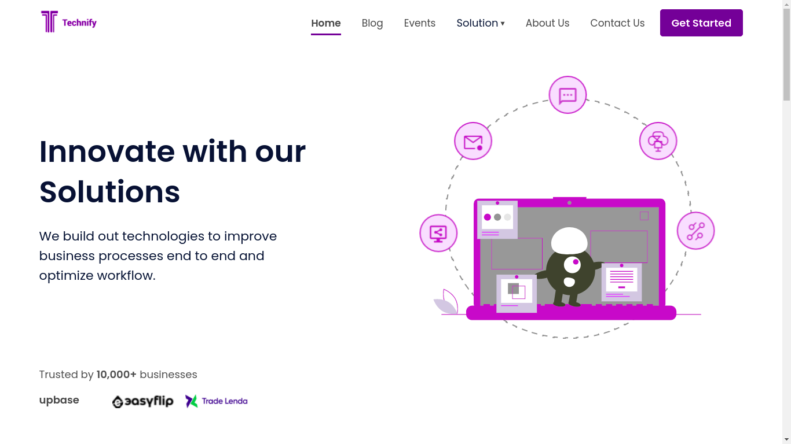

# Technify Inc.



## About the project

This repository contains the design (Frontend+Backend) for `Technify Inc.`

We are a team of young, result-driven professionals, committed to
excellence and global standards. Solving high-impact problems with
technology; changing lifestyle and business culture in Africa.

`Technify Inc.` is a firm that develops and deploys software solutions
at scale to solve high-impact business challenges.

We help Improve software infrastructure with well-built
microservices, reliable API, and data integration. Launch your
mobile strategy with our comprehensive enterprise application
development, or use our enterprise app integration solutions.

## Tech Stack

**Client:** VueJS, Vuex

**Server:** Postman

### Tools and Cheatsheet

Before running the project locally, make sure the following have been installed:

- Node
- NPM
- Vue 3

Libraries and packages used:

- [Vue](https://vuejs.org/)
- [Vuex](https://vuex.vuejs.org/)
- [Vue Router](https://router.vuejs.org/)
- [Vuelidate](https://vuelidate-next.netlify.app/)
- [Moment](https://momentjs.com/)
- [MDI Fonts](https://materialdesignicons.com/)
- [AOS - Animate On Scroll](https://michalsnik.github.io/aos/)
- [Axios](https://axios-http.com/)

Useful Links:

- [Figma](https://www.figma.com/file/4dKMZcOdQIxlkep3CPnJ7I/Technify-Incubator-s-team-library)
- [Staging URL](https://technifyy.netlify.app/)
- [Production URL](https://www.technifyincubator.com/)

### Building the app locally

Clone the project

```bash
  git clone https://github.com/technifyinc/technify-website.git
```

Go to the project directory

```bash
  cd technify-website
```

Install dependencies

```bash
  npm install
```

Start the server

```bash
  npm run serve
```

### Code Standards

- Folder names should be in `camelCase` e.g `components, getStarted, auth`
- Vue files should be in `PascalCase` e.g `Home.vue, TheFooter.vue, BaseInput.vue`
- Make sure to run `npm run lint` before pushing any code.
- Never use `v-if` on the same element as `v-for`

### VueJS Style

All code must meet the [Style Guide](https://v3.vuejs.org/style-guide/). This makes certain that all code is the same format as the existing code and means it will be as readable as possible.
Any code written otherwise will not be approved.

#### Important !

Once you see an issue that you'd like to work on, please post a comment saying
that you want to work on it. Something like "I want to work on this" is fine.
Also, make sure to assign the issue to yourself so others know someone is
already working on it.

## Pull Request Checklist

When you submit your pull request, or you push new commits to it, our automated
systems will run some checks on your new code. We require that your pull request
passes these checks, but we also have more criteria than just that before we can
accept and merge it. We recommend that you check the following things locally
before you submit your code:

- It passes tests: run the following command to run all of the tests locally:

  ```
  npm run test:unit
  ```

  ```
  npm run lint
  ```

- Impacted code has new or updated tests
- Documentation created/updated
- Follows all the code standards required.
